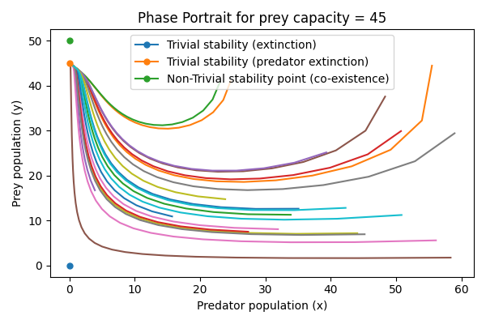
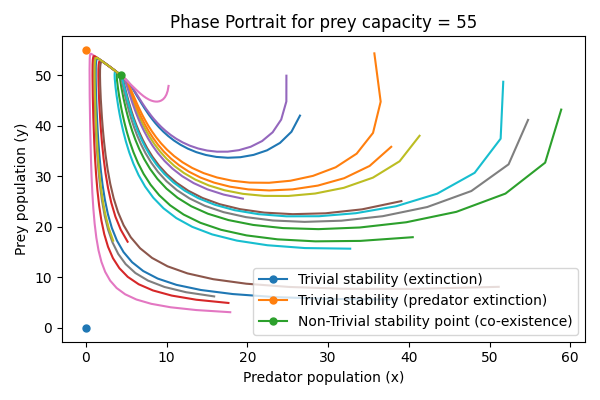
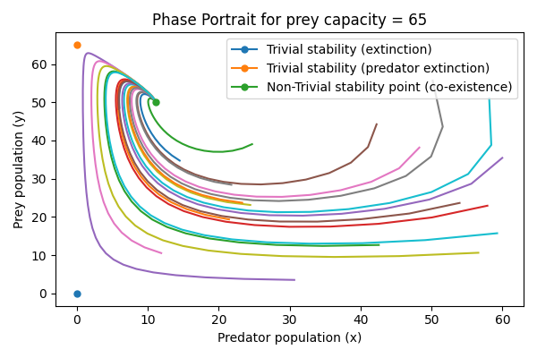
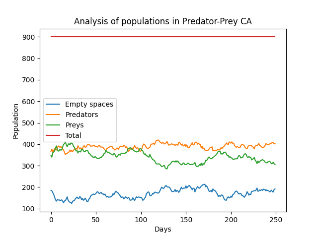
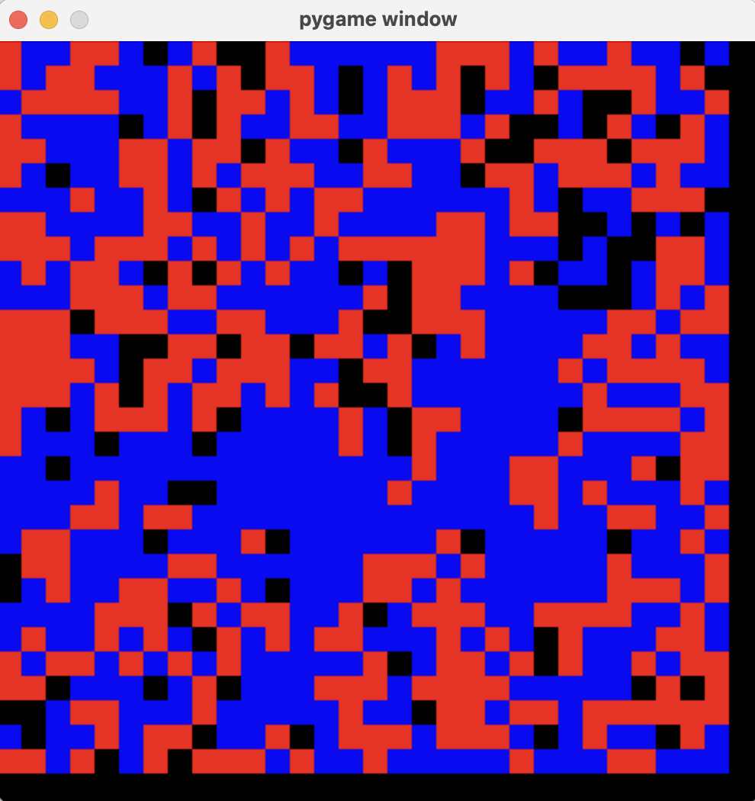
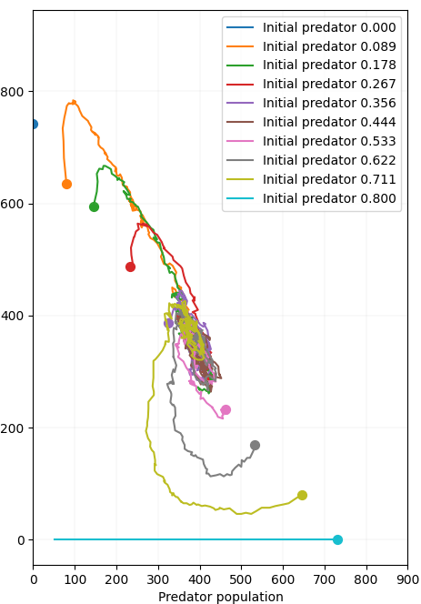
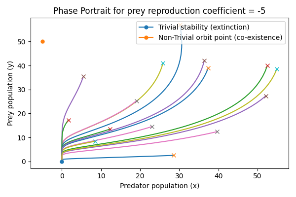
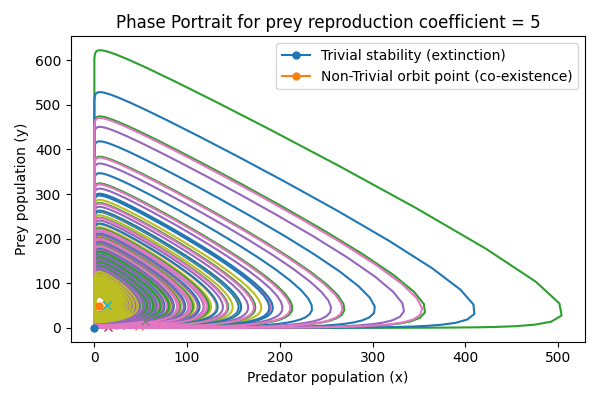

# Weekly progress journal

## Instructions

In this journal you will document your progress of the project, making use of the weekly milestones.

Every week you should 

1. write down **on the day of the lecture** a short plan (bullet list is sufficient) of how you want to 
   reach the weekly milestones. Think about how to distribute work in the group, 
   what pieces of code functionality need to be implemented.
2. write about your progress **until Tuesday, 11:00** before the next lecture with respect to the milestones.
   Substantiate your progress with links to code, pictures or test results. Reflect on the
   relation to your original plan.

We will give feedback on your progress on Tuesday before the following lecture. Consult the 
[grading scheme](https://computationalphysics.quantumtinkerer.tudelft.nl/proj3-grading/) 
for details how the journal enters your grade.

Note that the file format of the journal is *markdown*. This is a flexible and easy method of 
converting text to HTML. 
Documentation of the syntax of markdown can be found 
[here](https://docs.gitlab.com/ee/user/markdown.html#gfm-extends-standard-markdown). 
You will find how to include [links](https://docs.gitlab.com/ee/user/markdown.html#links) and 
[images](https://docs.gitlab.com/ee/user/markdown.html#images) particularly.

## Week 1 - planning the project
(due 21 May 2025, 23:59)

**Description:**

This project explores spatial predator-prey dynamics via a two-species cellular automaton model inspired by the Lotka–Volterra system and Game of Life simulations. 
The goal is to simulate localized interactions of prey and predator populations on a 2D lattice and investigate how macroscopic phenomena such as population cycles, spatial pattern formation, and bifurcations arise from microscopic rules.

A core objective is to compare emergent behavior (e.g. extinction, coexistence, oscillations) with the analytical behavior of the ODE Lotka–Volterra model, including identifying bifurcations in parameters such as reproduction rates or mobility.

**Key Features of the Model:**

- Each cell in a 2D grid is either:

    1. Empty
    2. Occupied by a prey
    3. Occupied by a predator

- Update Rules:

    1. Prey reproduce if neighboring cells are empty (rate r_prey)
    2. Predators move randomly
    3. Predators eat prey in neighboring cells (rate r_eat)
    4. Predators die if they don’t eat for a number of steps (starvation time T_starve)

We can extend these rules by predator reproduction and movement of predator and prey (stochastic or deterministic), and by devising more complicated rules (prey cannot be eaten if it outnumbers predator, e.g.). 
Also, we could consider a kill probability (similar to an infection risk when dealing with epidemiological scenarios).

For a simple enough system, the observables (ratio of predator/prey, i.e., coexistence or extinction, etc.) might allow for a comparison to analytic predictions based on ODEs, but whether or not this is true is a question we want to answer with the project.

**References:**

https://arxiv.org/pdf/2405.05006

https://www.sciencedirect.com/topics/earth-and-planetary-sciences/lotka-volterra-model

https://deepblue.lib.umich.edu/bitstream/handle/2027.42/37881/260120305_ftp.pd?sequence=1

https://www.math.stonybrook.edu/~azinger/mat127-spr22/PredatorPreySystems.pdf

**Relevance:**
We think this project is relevant to Computational Physics since it aims to simulate a physical (biological) system that models an important phenomenon in nature, while extracting information from it that allows for comparison with theory.

**Tentative Milestones**

_Milestone 1 :_ Basic Implementation

    Implement 2D grid with discrete cell states (empty, prey, predator)
    Implement core update rules for prey and predator behavior
    Visualize the grid at each timestep
    ⁠Explore object-oriented programming to define classes for predator and prey

_Milestone 2:_ Data Collection and Analysis

    Track total prey and predator populations over time, given initial conditions (primarily number of predator and prey, but maybe also distribution on lattice)
    Plot population time series and extract oscillation characteristics (amplitude, frequency)

_Milestone 3:_ Parameter Sweep and Bifurcation Detection

    Vary key parameters r_prey, r_eat, T_starve:
    For each setting, simulate until steady-state or extinction
    Identify regimes: extinction (prey or predator), stable coexistence or oscillations
    Detect critical transitions and approximate bifurcation points

_Milestone 4:_ Comparison to Lotka–Volterra ODEs

    Write and numerically integrate the classical Lotka–Volterra equations (system of ODEs)
    Compare simulation results to analytical prediction by matching initial conditions and updates as good as possible

## Week 2
(due 27 May 2025, 11:00)

In order to set a good baseline, we first worked on the Lotka-Volterra system over the last week, deriving the behaviour analytically and confirming it numerically.
The analytic derivation can be found [here.](https://gitlab.kwant-project.org/computational_physics/projects/Project3_Arturo_chernandodelaf_tneumann/-/blob/master/journal_data/Cellular_Automata_Predator_Prey__CP3_-2.pdf?ref_type=heads)
As described in the above .pdf, we find bifurcations from extinction to co-existence at prey capacity $N = 50$ and $N = 60$.

-- Extinction of predator

{ width=300px }

-- Coexistence (sink behaviour)

{ width=300px }

-- Coexistence (spiral sink behaviour)

{ width=300px }

The code that generates the trajectories for each prey capacity can be accessed [here.](https://gitlab.kwant-project.org/computational_physics/projects/Project3_Arturo_chernandodelaf_tneumann/-/blob/master/simulation_analytical.py?ref_type=heads) Note that we used a simple first-order integration technique, which seems to suffice.

Having set the baseline, we started to implement the cellular automata. Therefore, we defined an object-oriented approach on a 2D grid.

We defined two classes:
    - Cell class, with attributes: species (empty->0, predator->1, prey->2) and energy, which influences processes such as hunting and death; and methods: prey reproduction hunt, movement and hunt+predator reproduction
    - Habitat class, with attributes: width and height, a lattice of Cell objects, and the number of each population; and methods: initialization, evolve (where each cell carries their action), and get populations

With a grid of 10 x 10 and number of steps = 30, we obtained the following graph of populations evolution:

{ width=300px }

The corresponding code can be accessed [here.](https://gitlab.kwant-project.org/computational_physics/projects/Project3_Arturo_chernandodelaf_tneumann/-/blob/master/ca_pred_prey.py?ref_type=heads)

Thus, we completed Milestone $4$ (since we pivoted to establishing the baseline first) up to the comparison, and completed Milestone $1$. Before next week, we plan to be able to track population dynamics with the CA as well, such that during the next week, we can fit the CA simulation to the LV model in order to compare the predictions. 
Next week, we will also analyse the behaviour of the populations when varying different parameters.

*Weekly planning items* 
- Create movie/animation of system (Cesar)
- Create phase diagram over different trajectories for CA (Arturo)
- Tweak parameters in original CA simulation to make simulation more realistic and observe bifurcations (Arturo, Cesar)
- Create duplicate code with simplfied update rules (probabilities instead of energy) to ensure commensurability with analytical simulation (Tim)

Goal: Simulate and analyze both a complex (realistic) and simple (comparable) CA simulation and interpret different dynamic behaviour regimes 

## Week 3
(due 3 June 2025, 11:00)

- We created a second CA simulation, which is based on probabilities (for hunting, reproduction and death) rather than on energy. While the energy-based CA simulation is eventually targeting a closer approximation 
of a real-world scenario, the motivation behind this is to allow some sort of commensurability with the analytical model implemented [here.](https://gitlab.kwant-project.org/computational_physics/projects/Project3_Arturo_chernandodelaf_tneumann/-/blob/master/simulation_analytical.py?ref_type=heads)
- The probabilistic model displays a relatively stable coexistence of species:

-- Coexistence in probabilistic CA model

{ width=300px }
{ width=220px }

-- spiral sink behaviour

{ width=300px }

- Added second variant of analyical model in [simulation file](https://gitlab.kwant-project.org/computational_physics/projects/Project3_Arturo_chernandodelaf_tneumann/-/blob/master/simulation_analytical.py?ref_type=heads), exhibiting exponential (rather than logistic) growth of prey. This leads to exponential decline (leading to mutual extinction) or limit cycles, where the bifurcation between those two behaviours can be interpreted as $\gamma = 0$ in the LV model.

-- Bifurcation: $\gamma = -5$ (left), $\gamma = +5$ (right)

{ width=300px }
{ width=300px }

- We are able to qualitatively compare our CA models to the two analytical LV models from here: The more realistic energy-based CA model seems to (qualitatively) match the LV model with exponential growth, whereas the probabilistic model matches this with logistic growth (it is unclear to us whether this is by construction or a coincidence due to the choice of concrete hyperparameters)

- Created Phase diagrams

- Created movie simulation

- Updated management of parameters, defining them in the [parameters.py](https://gitlab.kwant-project.org/computational_physics/projects/Project3_Arturo_chernandodelaf_tneumann/-/blob/master/parameters.py?ref_type=heads) and calling them in the [main.py](https://gitlab.kwant-project.org/computational_physics/projects/Project3_Arturo_chernandodelaf_tneumann/-/blob/master/main.py?ref_type=heads) file for the simulation

- Trial of different combinations of parameters to test different behaviours

-- Parameters 1: Balanced and expected behaviour of predator and prey populations, resulting in a similar behaviour as the probabilistic model as well as the analytical simulation;

{ width=300px }
{ width=300px }
{ width=300px }
{ width=300px }
{ width=300px }
{ width=300px }

-- Parameters 2: Unbalanced behaviour, trying to favour the predator's population ;

{ width=300px }
{ width=300px }
{ width=300px }
{ width=300px }
{ width=300px }
{ width=300px }

However, in this situation, we did not get the expected situation where the population of the predator is definitely larger than that of the prey. This situation must be studied more extensively.

-- Parameters 3: Abnormal behaviour, where the predator's population dissapears, contradicting the expected situation;

{ width=300px }
{ width=300px }
{ width=300px }
{ width=300px }
{ width=300px }
{ width=300px }

In this set of parameters we considered a large reproduction threshold energy for the prey, expecting an extinction of this animal. However, the opposite scenario is encountered, where the predator dissapears. This shall be further studied.

*Plan for next week* 
- Make existing energy-based CA model more realistic by introducing more features
- Perform hyperparemeter testing to identify phase transitions/bifurctations in both CA models
- Gather results and prepare presentation

- Study and correct abnormal behaviour with Prey population when increasing the reproduction energy threshold.
- Track previous positions in the energy CA model
- Qualitatively compare the CA results with the analytical Lotka-Volterra. Compare the latter with literature. 
- In the energy CA model, implement counting function to check if the current dynamical counting is correct.
- Test energy CA model with larger grid. 
- Produce movie for probabilistic model for a 100x100 grid

## Reminder final deadline

The deadline for project 3 is **9 June 23:59**. By then, you must have uploaded the presentation slides to the repository, and the repository must contain the latest version of the code.
